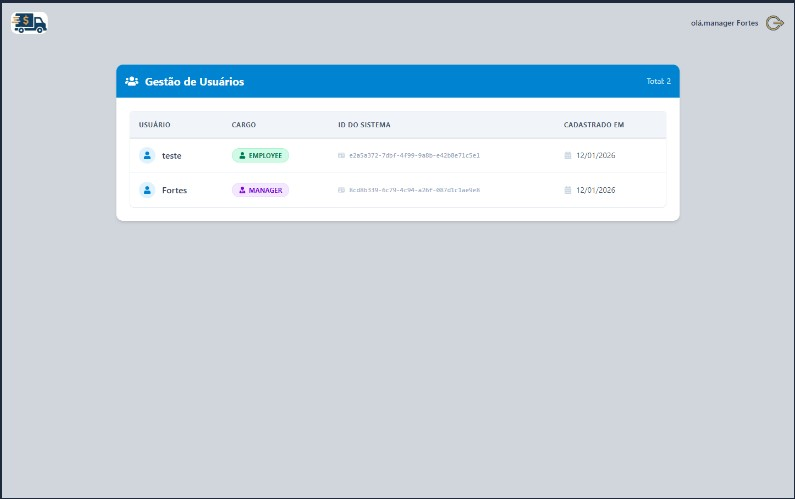
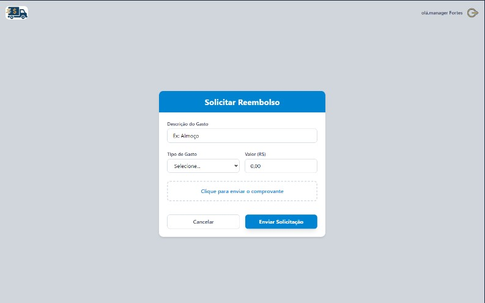

# 💸 Sistema de Reembolso - Frontend

Interface web desenvolvida para o gerenciamento de solicitações de reembolso corporativo. O sistema possui controle de acesso baseado em cargos (RBAC), diferenciando as funcionalidades para **Funcionários** e **Gerentes**.


## 📸 Telas do Projeto

| Login | Dashboard (Gerente) | Solicitação (Funcionário) |
|:---:|:---:|:---:|
|  |  |  |

## 🚀 Funcionalidades

### 🔐 Autenticação e Segurança
- Login e Cadastro de usuários.
- Autenticação via **JWT (JSON Web Token)**.
- Persistência de sessão (LocalStorage).
- Proteção de rotas (Middleware no Front-end).
- Redirecionamento inteligente baseado no cargo (Role).

### 👤 Perfil: Funcionário (Employee)
- Acesso à tela de **Solicitação de Reembolso**.
- Formulário para envio de comprovantes (Upload), valor, tipo de gasto e descrição. (Em Desenvolvimento)
- Feedback visual de sucesso ou erro.(Em Desenvolvimento)

### 👔 Perfil: Gerente (Manager)
- Acesso exclusivo ao **Dashboard Administrativo**.
- Visualização de todos os usuários cadastrados no sistema.
- Listagem com ID, Nome, Cargo e Data de Criação.
- Indicadores visuais (Badges) para diferenciar cargos.
- Visualizar Despesas enviadas por funcionários (Em Desenvolvimento)

---

## 🛠️ Tecnologias Utilizadas

- **[React](https://reactjs.org/)** - Biblioteca para construção de interfaces.
- **[Vite](https://vitejs.dev/)** - Build tool rápida e leve.
- **[TypeScript](https://www.typescriptlang.org/)** - Superset JavaScript com tipagem estática.
- **[Tailwind CSS](https://tailwindcss.com/)** - Framework de estilização utilitário.
- **[Axios](https://axios-http.com/)** - Cliente HTTP para comunicação com a API.
- **[React Router Dom](https://reactrouter.com/)** - Gerenciamento de rotas.
- **[React Icons](https://react-icons.github.io/react-icons/)** - Ícones (FontAwesome).

---

## 📦 Como rodar o projeto

### Pré-requisitos
- Ter o **Node.js** instalado.
- Ter a **API (Backend)** rodando na porta `3333` (ou configurar a URL).

### Passo a passo

1. **Clone o repositório**
   ```bash
   git clone [https://github.com/seu-usuario/seu-repositorio.git](https://github.com/seu-usuario/seu-repositorio.git)